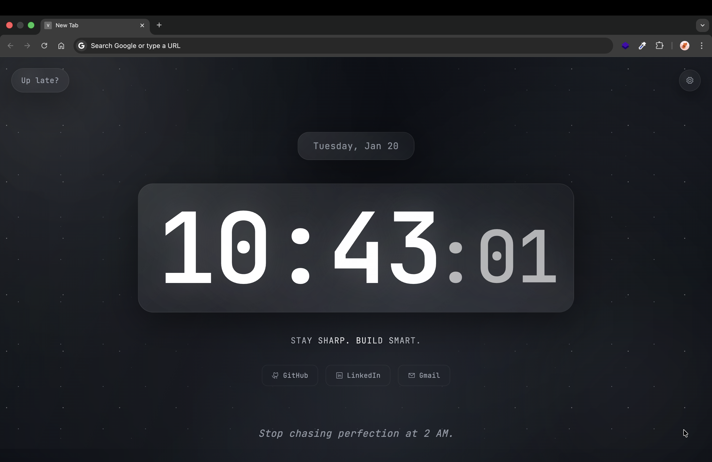
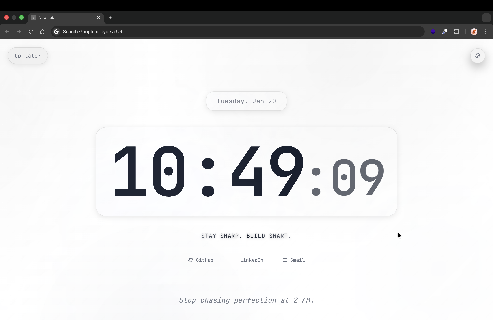
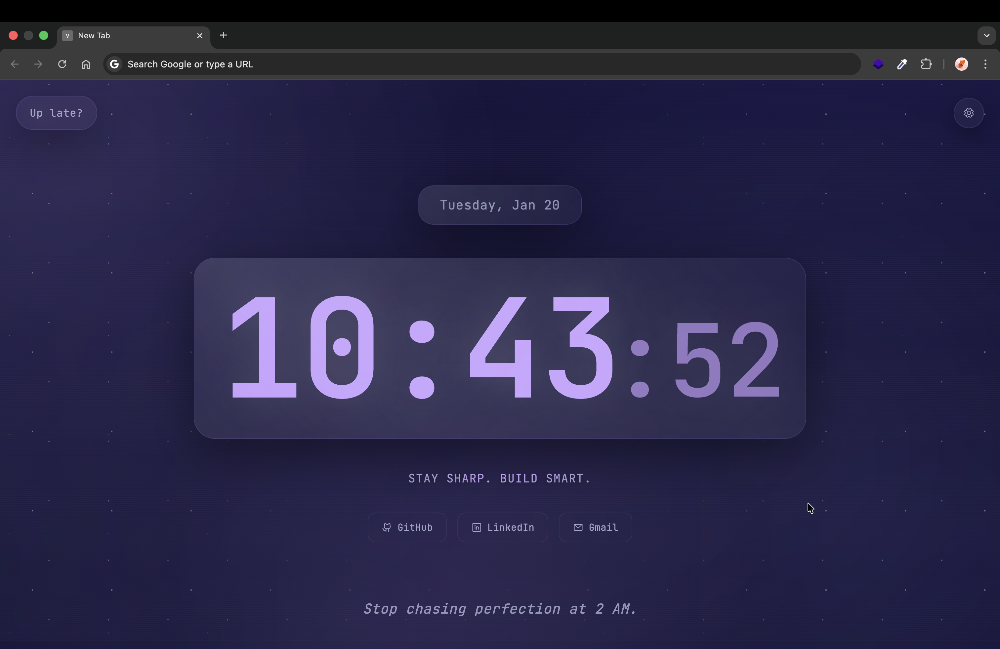
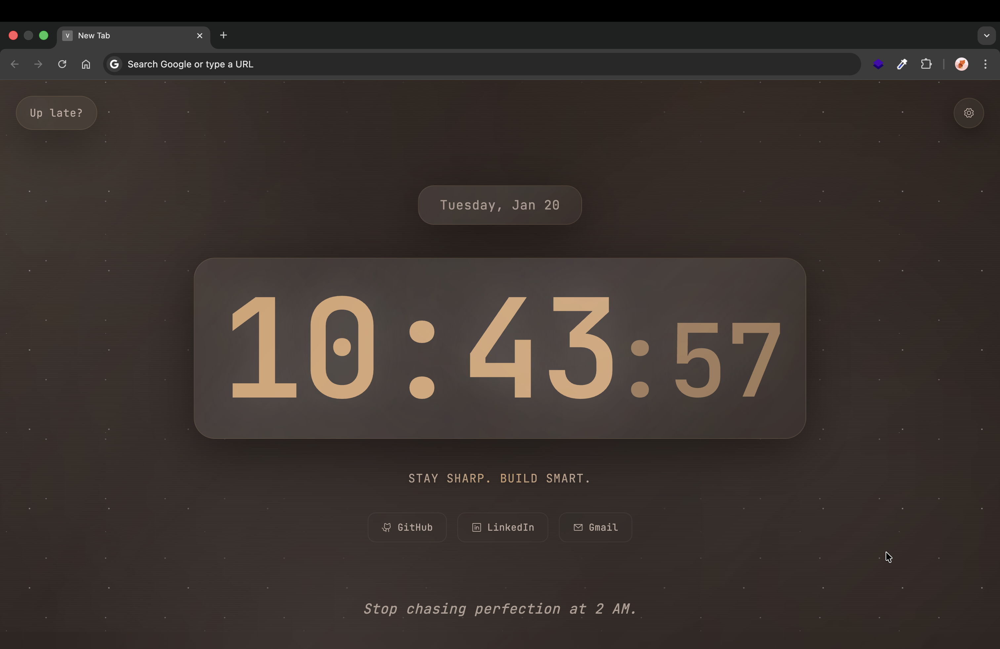

# Vista - Minimal Productive New Tab

Vista is a lightweight, high-performance New Tab extension focused on aesthetics, speed, and focus. It replaces your default new tab page with a clean, ambient interface featuring a clock, greeting, and quick links, all customizable with beautiful themes.

## Features

- **⚡ Blazing Fast**: Optimized for speed (<300ms load time).
- **🎨 Dynamic Themes**: Choose from Dark, Light, Nebula, Coffee, Botanical, and Rose color palettes.
- **✨ Ambient Visuals**: Beautiful, animated background gradients and orbs that adapt to your theme.
- **🕰️ Clean Interface**: Minimal clock, date, and greeting to keep you focused.
- **🔗 Quick Actions**: Fast access to your most used links.
- **⚙️ Custom Settings**: Easy-to-use settings panel to toggle themes and preferences.

## Themes

Vista comes with a variety of carefully curated themes to suit your mood:
| Dark | Light |
| :---: | :---: |
|  |  |

| Nebula | Coffee |
| :---: | :---: |
|  |  |

| Botanical | Rose |
| :---: | :---: |
|  |  |

## Installation

1.  Clone this repository.
2.  Open Chrome and navigate to `chrome://extensions`.
3.  Enable "Developer mode" in the top right corner.
4.  Click "Load unpacked" and select the extension directory.

## Tech Stack

- **HTML5**: Semantic structure.
- **CSS3**: Advanced animations, variables, and responsive design.
- **JavaScript (ES6+)**: Modular logic for clock, themes, and settings.

## License

MIT License. Free to use and modify.
